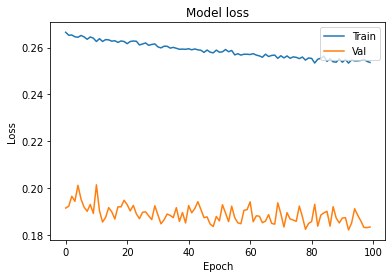
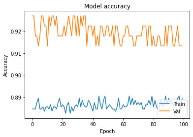
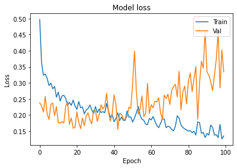
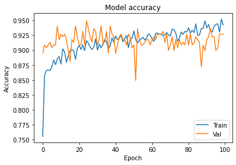
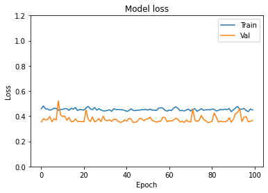
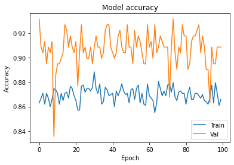

# Prediction of House Price Based on The Back Propagation Neural Network in The Keras Deep Learning Framework

#  Introduction

House prices have been increasing in recent years, in tandem with the global economy's rapid growth. The real estate sector has gradually grown to become a significant pillar of the global economy. In this environment, nearly everybody is paying attention to the home market trend and attempting to use more empirical and effective approaches to make correct housing price forecasts. Aside from the effect of the house's characteristics, other factors, especially the characteristics of the parties to the sale, have an impact on the house's price. The house price dilemma can be seen as a large open complex system with a lot of complexity, volatility, nonlinearity, and dynamics.


This study uses the chain home network's housing data to forecast the price of used housing in Shanghai. To begin, this paper uses crawler technologies to decode the URL text information using the BeautifulSoup parser and the json request address. Then, using the Keras deep learning library, a multi-layer feedforward neural network model is equipped using the error inverse propagation algorithm. 

The data used in this paper was crawled from the Web Host using crawler technology, and experiments were performed using a back propagation neural network (BP neural network) model based on the Keras paradigm. The BP neural network is a multilayer feedforward network that has been trained using the error inverse propagation algorithm. It's one of the most common neural network models out there. It can learn and store a huge number of input-output mode mappings without disclosing the mapping relationship's mathematical equations. Its learning rule is to use the gradient steepest descent approach to continuously change the network's weight and threshold through error back propagation until the network's square error reaches a minimum. For housing price forecasting, 12 variables influencing real estate are chosen; the selected indicators have different aspects such as geographic coordinates, traffic orientation, and housing type. The abnormal value was processed using random forest during the experiment, and a better prediction outcome was obtained as a result.


### Keras 

Keras is a Python-based neural network library with a high degree of modularity. The backend may be either TensorFlow or Theano [1]. Keras also includes modules such as activation function modules, sheet modules, preprocessing modules, objective function modules, optimisation system selection modules, and so on. Activation function modules and optimisation process selection modules [2] are two of them, and they combine all of the most recent and best optimization approaches and activation functions. Network models can be easily developed with these components, and core parameters of neural networks can be enhanced.

### Back Propagation NN

The BP NN [3] is a multi-layer feedforward NN trained by using the error back propagation algorithm suggested by the Mccelland  and Rumelhart in 1986. It typically consists of three layers: input, hidden, and output. Figure 1 depicts the network structure. 


# Results 

The analysis with the absolute value of the relative error between the expected value and the real value is within 5%, accounting for 95.59 percent, according to the measurement and statistical result. The neural network built by other documents of the same type was applied to the data of this experiment for comparison in order to verify the validity of the experiment. The results of the studies indicate that the NN developed in this analysis are marginally better than previous neural networks and have good model performance.


## Paper Analyzed for this blog
   Z. Jiang and G. Shen, "Prediction of House Price Based on The Back Propagation Neural Network in The Keras Deep Learning Framework," 2019 6th International Conference on        Systems and Informatics (ICSAI), Shanghai, China, 2019, pp. 1408-1412, doi: 10.1109/ICSAI48974.2019.9010071.

## Work Cited

1] Ang L I , Yi-Xiang L I , Xue-Hui L I . TensorFlow and Keras-based Convolutional Neural Network in CAT Image Recognition. 2017.

[2] Wisanlaya Pornprakun, et al. Determining optimal policies for sugarcane harvesting in Thailand using bi-objective and quasi-Newton optimization methods. Advances in Difference Equations, 2019, Vol.2019 (1), pp.1-15

[3] Dayhoff J E, Deleo J M. Artificial neural networks. Cancer, 2001, 91(8):1615-1634. 

# Our Trained Networks

In this study, we’ve written Python code to:
  * 	Explore and Process the Dataset
  *	Build and Train our NN
  *	Visualize  Accuracy and Loss
  *	Add Regularization to NN
We've been through a lot, but we haven't written too much code! It only took about 4 to 5 lines of code to construct and train our Neural Network, and playing with different model architectures is as easy as swapping in different layers or modifying different hyperparameters.

We have trained three different networks and achieved an highest accuracy of 92.69%. Training and testing accuracy of our bestfitted model is shown in figure.


Our simulations are available on "https://github.com/SaifZahrani/DeepLearning"


```python
#Import Liberaries
import pandas as pd
import tensorflow as tf
```


```python
#Reading Dataset FIle
df = pd.read_csv('housepricedata.csv')
```


```python
#DIsplaying dataframe
df
```


<div>

<table border="1" class="dataframe">
  <thead>
    <tr style="text-align: right;">
      <th></th>
      <th>LotArea</th>
      <th>OverallQual</th>
      <th>OverallCond</th>
      <th>TotalBsmtSF</th>
      <th>FullBath</th>
      <th>HalfBath</th>
      <th>BedroomAbvGr</th>
      <th>TotRmsAbvGrd</th>
      <th>Fireplaces</th>
      <th>GarageArea</th>
      <th>AboveMedianPrice</th>
    </tr>
  </thead>
  <tbody>
    <tr>
      <th>0</th>
      <td>8450</td>
      <td>7</td>
      <td>5</td>
      <td>856</td>
      <td>2</td>
      <td>1</td>
      <td>3</td>
      <td>8</td>
      <td>0</td>
      <td>548</td>
      <td>1</td>
    </tr>
    <tr>
      <th>1</th>
      <td>9600</td>
      <td>6</td>
      <td>8</td>
      <td>1262</td>
      <td>2</td>
      <td>0</td>
      <td>3</td>
      <td>6</td>
      <td>1</td>
      <td>460</td>
      <td>1</td>
    </tr>
    <tr>
      <th>2</th>
      <td>11250</td>
      <td>7</td>
      <td>5</td>
      <td>920</td>
      <td>2</td>
      <td>1</td>
      <td>3</td>
      <td>6</td>
      <td>1</td>
      <td>608</td>
      <td>1</td>
    </tr>
    <tr>
      <th>3</th>
      <td>9550</td>
      <td>7</td>
      <td>5</td>
      <td>756</td>
      <td>1</td>
      <td>0</td>
      <td>3</td>
      <td>7</td>
      <td>1</td>
      <td>642</td>
      <td>0</td>
    </tr>
    <tr>
      <th>4</th>
      <td>14260</td>
      <td>8</td>
      <td>5</td>
      <td>1145</td>
      <td>2</td>
      <td>1</td>
      <td>4</td>
      <td>9</td>
      <td>1</td>
      <td>836</td>
      <td>1</td>
    </tr>
    <tr>
      <th>...</th>
      <td>...</td>
      <td>...</td>
      <td>...</td>
      <td>...</td>
      <td>...</td>
      <td>...</td>
      <td>...</td>
      <td>...</td>
      <td>...</td>
      <td>...</td>
      <td>...</td>
    </tr>
    <tr>
      <th>1455</th>
      <td>7917</td>
      <td>6</td>
      <td>5</td>
      <td>953</td>
      <td>2</td>
      <td>1</td>
      <td>3</td>
      <td>7</td>
      <td>1</td>
      <td>460</td>
      <td>1</td>
    </tr>
    <tr>
      <th>1456</th>
      <td>13175</td>
      <td>6</td>
      <td>6</td>
      <td>1542</td>
      <td>2</td>
      <td>0</td>
      <td>3</td>
      <td>7</td>
      <td>2</td>
      <td>500</td>
      <td>1</td>
    </tr>
    <tr>
      <th>1457</th>
      <td>9042</td>
      <td>7</td>
      <td>9</td>
      <td>1152</td>
      <td>2</td>
      <td>0</td>
      <td>4</td>
      <td>9</td>
      <td>2</td>
      <td>252</td>
      <td>1</td>
    </tr>
    <tr>
      <th>1458</th>
      <td>9717</td>
      <td>5</td>
      <td>6</td>
      <td>1078</td>
      <td>1</td>
      <td>0</td>
      <td>2</td>
      <td>5</td>
      <td>0</td>
      <td>240</td>
      <td>0</td>
    </tr>
    <tr>
      <th>1459</th>
      <td>9937</td>
      <td>5</td>
      <td>6</td>
      <td>1256</td>
      <td>1</td>
      <td>1</td>
      <td>3</td>
      <td>6</td>
      <td>0</td>
      <td>276</td>
      <td>0</td>
    </tr>
  </tbody>
</table>
<p>1460 rows × 11 columns</p>
</div>


```python
dataset = df.values
dataset
```


    array([[ 8450,     7,     5, ...,     0,   548,     1],
           [ 9600,     6,     8, ...,     1,   460,     1],
           [11250,     7,     5, ...,     1,   608,     1],
           ...,
           [ 9042,     7,     9, ...,     2,   252,     1],
           [ 9717,     5,     6, ...,     0,   240,     0],
           [ 9937,     5,     6, ...,     0,   276,     0]], dtype=int64)


```python
#Splliting features and target values in X and Y respectively
X = dataset[:,0:10]
Y = dataset[:,10]
```


```python
#importing preprocessing liberary for data preprocessing 
from sklearn import preprocessing
```


```python
#scales the dataset so that all the input features lie between 0 and 1
min_max_scaler = preprocessing.MinMaxScaler()
X_scale = min_max_scaler.fit_transform(X)
```


```python
X_scale
```


    array([[0.0334198 , 0.66666667, 0.5       , ..., 0.5       , 0.        ,
            0.3864598 ],
           [0.03879502, 0.55555556, 0.875     , ..., 0.33333333, 0.33333333,
            0.32440056],
           [0.04650728, 0.66666667, 0.5       , ..., 0.33333333, 0.33333333,
            0.42877292],
           ...,
           [0.03618687, 0.66666667, 1.        , ..., 0.58333333, 0.66666667,
            0.17771509],
           [0.03934189, 0.44444444, 0.625     , ..., 0.25      , 0.        ,
            0.16925247],
           [0.04037019, 0.44444444, 0.625     , ..., 0.33333333, 0.        ,
            0.19464034]])


```python
from sklearn.model_selection import train_test_split
```


```python
#test and training data splitting 
X_train, X_val_and_test, Y_train, Y_val_and_test = train_test_split(X_scale, Y, test_size=0.3)
```


```python
X_val, X_test, Y_val, Y_test = train_test_split(X_val_and_test, Y_val_and_test, test_size=0.5)
print(X_train.shape, X_val.shape, X_test.shape, Y_train.shape, Y_val.shape, Y_test.shape)
```

    (1022, 10) (219, 10) (219, 10) (1022,) (219,) (219,)
    

The code above will split the val_and_test size equally to the validation set and the test set.
It means that our test data is further devided into validation and text data.


```python
#istalling Keras framework
!pip3 install keras
```

    Requirement already satisfied: keras in c:\users\temporary\appdata\local\programs\python\python38\lib\site-packages (2.4.3)
    Requirement already satisfied: numpy>=1.9.1 in c:\users\temporary\appdata\local\programs\python\python38\lib\site-packages (from keras) (1.19.4)
    Requirement already satisfied: scipy>=0.14 in c:\users\temporary\appdata\local\programs\python\python38\lib\site-packages (from keras) (1.5.4)
    Requirement already satisfied: h5py in c:\users\temporary\appdata\local\programs\python\python38\lib\site-packages (from keras) (2.10.0)
    Requirement already satisfied: pyyaml in c:\users\temporary\appdata\local\programs\python\python38\lib\site-packages (from keras) (5.4.1)
    Requirement already satisfied: six in c:\users\temporary\appdata\local\programs\python\python38\lib\site-packages (from h5py->keras) (1.15.0)
    


```python
from keras.models import Sequential
from keras.layers import Dense
```

We have our first layer as a dense layer with 32 neurons, ReLU activation and the input shape is 10 since we have 10 input features. Note that ‘Dense’ refers to a fully-connected layer, which is what we will be using.

Our second layer is also a dense layer with 32 neurons, ReLU activation. Note that we do not have to describe the input shape since Keras can infer from the output of our first layer.

Our third layer is a dense layer with 1 neuron, sigmoid activation.


```python
# using the Sequential model, which means that we merely need to describe the layers
model = Sequential([
    Dense(128, activation='relu', input_shape=(10,)),
    Dense(128, activation='relu'),
    Dense(1, activation='sigmoid'),
])
```

We put the following settings inside the brackets after model.compile:

optimizer='sgd'

‘sgd’ refers to stochastic gradient descent (over here, it refers to mini-batch gradient descent)
loss='binary_crossentropy'

The loss function for outputs that take the values 1 or 0 is called binary cross entropy.

metrics=['accuracy']

Lastly, we want to track accuracy on top of the loss function. Now once we’ve run that cell, we are ready to train!


```python
model.compile(optimizer='sgd',
              loss='binary_crossentropy',
              metrics=['accuracy'])
```

The function is called ‘fit’ as we are fitting the parameters to the data. We have to specify what data we are training on, which is X_train and Y_train. Then, we specify the size of our mini-batch and how long we want to train it for (epochs). Lastly, we specify what our validation data is so that the model will tell us how we are doing on the validation data at each point. This function will output a history, which we save under the variable hist. We’ll use this variable a little later when we get to visualization.


```python
hist = model.fit(X_train, Y_train,
          batch_size=32, epochs=100,
          validation_data=(X_val, Y_val))
```

    Epoch 1/100
    32/32 [==============================] - 0s 12ms/step - loss: 0.2665 - accuracy: 0.8845 - val_loss: 0.1914 - val_accuracy: 0.9269
    Epoch 2/100
    32/32 [==============================] - 0s 8ms/step - loss: 0.2653 - accuracy: 0.8845 - val_loss: 0.1922 - val_accuracy: 0.9269
    Epoch 3/100
    32/32 [==============================] - 0s 7ms/step - loss: 0.2654 - accuracy: 0.8845 - val_loss: 0.1965 - val_accuracy: 0.9178
    Epoch 4/100
    32/32 [==============================] - 0s 8ms/step - loss: 0.2646 - accuracy: 0.8875 - val_loss: 0.1943 - val_accuracy: 0.9178
    Epoch 5/100
    32/32 [==============================] - 0s 8ms/step - loss: 0.2644 - accuracy: 0.8894 - val_loss: 0.2011 - val_accuracy: 0.9132
    Epoch 6/100
    32/32 [==============================] - 0s 7ms/step - loss: 0.2652 - accuracy: 0.8845 - val_loss: 0.1952 - val_accuracy: 0.9178
    Epoch 7/100
    32/32 [==============================] - 0s 7ms/step - loss: 0.2645 - accuracy: 0.8845 - val_loss: 0.1918 - val_accuracy: 0.9269
    Epoch 8/100
    32/32 [==============================] - 0s 7ms/step - loss: 0.2635 - accuracy: 0.8855 - val_loss: 0.1900 - val_accuracy: 0.9269
    Epoch 9/100
    32/32 [==============================] - 0s 8ms/step - loss: 0.2645 - accuracy: 0.8836 - val_loss: 0.1930 - val_accuracy: 0.9224
    Epoch 10/100
    32/32 [==============================] - 0s 7ms/step - loss: 0.2640 - accuracy: 0.8855 - val_loss: 0.1891 - val_accuracy: 0.9224
    Epoch 11/100
    32/32 [==============================] - 0s 8ms/step - loss: 0.2626 - accuracy: 0.8855 - val_loss: 0.2014 - val_accuracy: 0.9132
    Epoch 12/100
    32/32 [==============================] - 0s 7ms/step - loss: 0.2638 - accuracy: 0.8845 - val_loss: 0.1902 - val_accuracy: 0.9269
    Epoch 13/100
    32/32 [==============================] - 0s 8ms/step - loss: 0.2626 - accuracy: 0.8865 - val_loss: 0.1854 - val_accuracy: 0.9224
    Epoch 14/100
    32/32 [==============================] - 0s 8ms/step - loss: 0.2634 - accuracy: 0.8836 - val_loss: 0.1875 - val_accuracy: 0.9269
    Epoch 15/100
    32/32 [==============================] - 0s 8ms/step - loss: 0.2633 - accuracy: 0.8855 - val_loss: 0.1916 - val_accuracy: 0.9269
    Epoch 16/100
    32/32 [==============================] - 0s 8ms/step - loss: 0.2627 - accuracy: 0.8855 - val_loss: 0.1898 - val_accuracy: 0.9224
    Epoch 17/100
    32/32 [==============================] - 0s 8ms/step - loss: 0.2629 - accuracy: 0.8845 - val_loss: 0.1867 - val_accuracy: 0.9269
    Epoch 18/100
    32/32 [==============================] - 0s 7ms/step - loss: 0.2622 - accuracy: 0.8875 - val_loss: 0.1920 - val_accuracy: 0.9178
    Epoch 19/100
    32/32 [==============================] - 0s 9ms/step - loss: 0.2628 - accuracy: 0.8894 - val_loss: 0.1919 - val_accuracy: 0.9178
    Epoch 20/100
    32/32 [==============================] - 0s 7ms/step - loss: 0.2626 - accuracy: 0.8855 - val_loss: 0.1948 - val_accuracy: 0.9178
    Epoch 21/100
    32/32 [==============================] - 0s 8ms/step - loss: 0.2617 - accuracy: 0.8865 - val_loss: 0.1929 - val_accuracy: 0.9178
    Epoch 22/100
    32/32 [==============================] - 0s 7ms/step - loss: 0.2626 - accuracy: 0.8855 - val_loss: 0.1902 - val_accuracy: 0.9224
    Epoch 23/100
    32/32 [==============================] - 0s 8ms/step - loss: 0.2628 - accuracy: 0.8826 - val_loss: 0.1925 - val_accuracy: 0.9178
    Epoch 24/100
    32/32 [==============================] - 0s 8ms/step - loss: 0.2627 - accuracy: 0.8865 - val_loss: 0.1889 - val_accuracy: 0.9224
    Epoch 25/100
    32/32 [==============================] - 0s 8ms/step - loss: 0.2611 - accuracy: 0.8875 - val_loss: 0.1869 - val_accuracy: 0.9269
    Epoch 26/100
    32/32 [==============================] - 0s 8ms/step - loss: 0.2615 - accuracy: 0.8826 - val_loss: 0.1896 - val_accuracy: 0.9224
    Epoch 27/100
    32/32 [==============================] - 0s 7ms/step - loss: 0.2620 - accuracy: 0.8855 - val_loss: 0.1898 - val_accuracy: 0.9178
    Epoch 28/100
    32/32 [==============================] - 0s 8ms/step - loss: 0.2610 - accuracy: 0.8836 - val_loss: 0.1881 - val_accuracy: 0.9269
    Epoch 29/100
    32/32 [==============================] - 0s 9ms/step - loss: 0.2613 - accuracy: 0.8855 - val_loss: 0.1865 - val_accuracy: 0.9269
    Epoch 30/100
    32/32 [==============================] - 0s 8ms/step - loss: 0.2616 - accuracy: 0.8865 - val_loss: 0.1924 - val_accuracy: 0.9178
    Epoch 31/100
    32/32 [==============================] - 0s 7ms/step - loss: 0.2603 - accuracy: 0.8855 - val_loss: 0.1885 - val_accuracy: 0.9269
    Epoch 32/100
    32/32 [==============================] - 0s 9ms/step - loss: 0.2599 - accuracy: 0.8894 - val_loss: 0.1847 - val_accuracy: 0.9178
    Epoch 33/100
    32/32 [==============================] - 0s 8ms/step - loss: 0.2606 - accuracy: 0.8855 - val_loss: 0.1864 - val_accuracy: 0.9269
    Epoch 34/100
    32/32 [==============================] - 0s 8ms/step - loss: 0.2605 - accuracy: 0.8885 - val_loss: 0.1889 - val_accuracy: 0.9224
    Epoch 35/100
    32/32 [==============================] - 0s 7ms/step - loss: 0.2598 - accuracy: 0.8865 - val_loss: 0.1883 - val_accuracy: 0.9269
    Epoch 36/100
    32/32 [==============================] - 0s 8ms/step - loss: 0.2601 - accuracy: 0.8855 - val_loss: 0.1873 - val_accuracy: 0.9269
    Epoch 37/100
    32/32 [==============================] - 0s 7ms/step - loss: 0.2597 - accuracy: 0.8855 - val_loss: 0.1916 - val_accuracy: 0.9132
    Epoch 38/100
    32/32 [==============================] - 0s 8ms/step - loss: 0.2593 - accuracy: 0.8885 - val_loss: 0.1857 - val_accuracy: 0.9224
    Epoch 39/100
    32/32 [==============================] - 0s 7ms/step - loss: 0.2593 - accuracy: 0.8875 - val_loss: 0.1895 - val_accuracy: 0.9224
    Epoch 40/100
    32/32 [==============================] - 0s 8ms/step - loss: 0.2592 - accuracy: 0.8855 - val_loss: 0.1851 - val_accuracy: 0.9224
    Epoch 41/100
    32/32 [==============================] - 0s 8ms/step - loss: 0.2595 - accuracy: 0.8836 - val_loss: 0.1925 - val_accuracy: 0.9178
    Epoch 42/100
    32/32 [==============================] - 0s 7ms/step - loss: 0.2590 - accuracy: 0.8875 - val_loss: 0.1894 - val_accuracy: 0.9224
    Epoch 43/100
    32/32 [==============================] - 0s 7ms/step - loss: 0.2594 - accuracy: 0.8845 - val_loss: 0.1912 - val_accuracy: 0.9132
    Epoch 44/100
    32/32 [==============================] - 0s 8ms/step - loss: 0.2590 - accuracy: 0.8845 - val_loss: 0.1941 - val_accuracy: 0.9178
    Epoch 45/100
    32/32 [==============================] - 0s 8ms/step - loss: 0.2588 - accuracy: 0.8904 - val_loss: 0.1908 - val_accuracy: 0.9132
    Epoch 46/100
    32/32 [==============================] - 0s 7ms/step - loss: 0.2579 - accuracy: 0.8865 - val_loss: 0.1873 - val_accuracy: 0.9224
    Epoch 47/100
    32/32 [==============================] - 0s 7ms/step - loss: 0.2589 - accuracy: 0.8845 - val_loss: 0.1877 - val_accuracy: 0.9224
    Epoch 48/100
    32/32 [==============================] - 0s 8ms/step - loss: 0.2580 - accuracy: 0.8885 - val_loss: 0.1845 - val_accuracy: 0.9178
    Epoch 49/100
    32/32 [==============================] - 0s 8ms/step - loss: 0.2577 - accuracy: 0.8904 - val_loss: 0.1836 - val_accuracy: 0.9178
    Epoch 50/100
    32/32 [==============================] - 0s 10ms/step - loss: 0.2589 - accuracy: 0.8845 - val_loss: 0.1878 - val_accuracy: 0.9224
    Epoch 51/100
    32/32 [==============================] - 0s 8ms/step - loss: 0.2580 - accuracy: 0.8855 - val_loss: 0.1859 - val_accuracy: 0.9224
    Epoch 52/100
    32/32 [==============================] - 0s 7ms/step - loss: 0.2582 - accuracy: 0.8865 - val_loss: 0.1929 - val_accuracy: 0.9178
    Epoch 53/100
    32/32 [==============================] - 0s 8ms/step - loss: 0.2592 - accuracy: 0.8855 - val_loss: 0.1893 - val_accuracy: 0.9178
    Epoch 54/100
    32/32 [==============================] - 0s 8ms/step - loss: 0.2582 - accuracy: 0.8845 - val_loss: 0.1856 - val_accuracy: 0.9224
    Epoch 55/100
    32/32 [==============================] - 0s 8ms/step - loss: 0.2588 - accuracy: 0.8845 - val_loss: 0.1922 - val_accuracy: 0.9132
    Epoch 56/100
    32/32 [==============================] - 0s 7ms/step - loss: 0.2569 - accuracy: 0.8836 - val_loss: 0.1873 - val_accuracy: 0.9224
    Epoch 57/100
    32/32 [==============================] - 0s 7ms/step - loss: 0.2574 - accuracy: 0.8855 - val_loss: 0.1851 - val_accuracy: 0.9224
    Epoch 58/100
    32/32 [==============================] - 0s 9ms/step - loss: 0.2568 - accuracy: 0.8894 - val_loss: 0.1847 - val_accuracy: 0.9178
    Epoch 59/100
    32/32 [==============================] - ETA: 0s - loss: 0.2561 - accuracy: 0.88 - 0s 7ms/step - loss: 0.2572 - accuracy: 0.8845 - val_loss: 0.1905 - val_accuracy: 0.9132
    Epoch 60/100
    32/32 [==============================] - 0s 7ms/step - loss: 0.2571 - accuracy: 0.8845 - val_loss: 0.1907 - val_accuracy: 0.9132
    Epoch 61/100
    32/32 [==============================] - 0s 7ms/step - loss: 0.2570 - accuracy: 0.8865 - val_loss: 0.1941 - val_accuracy: 0.9178
    Epoch 62/100
    32/32 [==============================] - 0s 7ms/step - loss: 0.2574 - accuracy: 0.8855 - val_loss: 0.1855 - val_accuracy: 0.9178
    Epoch 63/100
    32/32 [==============================] - 0s 7ms/step - loss: 0.2568 - accuracy: 0.8855 - val_loss: 0.1881 - val_accuracy: 0.9224
    Epoch 64/100
    32/32 [==============================] - 0s 7ms/step - loss: 0.2564 - accuracy: 0.8865 - val_loss: 0.1879 - val_accuracy: 0.9224
    Epoch 65/100
    32/32 [==============================] - 0s 7ms/step - loss: 0.2559 - accuracy: 0.8904 - val_loss: 0.1852 - val_accuracy: 0.9178
    Epoch 66/100
    32/32 [==============================] - 0s 7ms/step - loss: 0.2572 - accuracy: 0.8865 - val_loss: 0.1858 - val_accuracy: 0.9178
    Epoch 67/100
    32/32 [==============================] - 0s 8ms/step - loss: 0.2562 - accuracy: 0.8894 - val_loss: 0.1886 - val_accuracy: 0.9178
    Epoch 68/100
    32/32 [==============================] - 0s 7ms/step - loss: 0.2566 - accuracy: 0.8865 - val_loss: 0.1849 - val_accuracy: 0.9132
    Epoch 69/100
    32/32 [==============================] - 0s 7ms/step - loss: 0.2568 - accuracy: 0.8885 - val_loss: 0.1845 - val_accuracy: 0.9132
    Epoch 70/100
    32/32 [==============================] - 0s 7ms/step - loss: 0.2554 - accuracy: 0.8865 - val_loss: 0.1936 - val_accuracy: 0.9178
    Epoch 71/100
    32/32 [==============================] - 0s 7ms/step - loss: 0.2565 - accuracy: 0.8875 - val_loss: 0.1889 - val_accuracy: 0.9178
    Epoch 72/100
    32/32 [==============================] - 0s 8ms/step - loss: 0.2556 - accuracy: 0.8865 - val_loss: 0.1833 - val_accuracy: 0.9178
    Epoch 73/100
    32/32 [==============================] - 0s 7ms/step - loss: 0.2564 - accuracy: 0.8875 - val_loss: 0.1895 - val_accuracy: 0.9178
    Epoch 74/100
    32/32 [==============================] - 0s 7ms/step - loss: 0.2554 - accuracy: 0.8845 - val_loss: 0.1868 - val_accuracy: 0.9224
    Epoch 75/100
    32/32 [==============================] - 0s 8ms/step - loss: 0.2560 - accuracy: 0.8845 - val_loss: 0.1863 - val_accuracy: 0.9224
    Epoch 76/100
    32/32 [==============================] - 0s 7ms/step - loss: 0.2558 - accuracy: 0.8865 - val_loss: 0.1858 - val_accuracy: 0.9224
    Epoch 77/100
    32/32 [==============================] - 0s 7ms/step - loss: 0.2553 - accuracy: 0.8865 - val_loss: 0.1923 - val_accuracy: 0.9132
    Epoch 78/100
    32/32 [==============================] - 0s 8ms/step - loss: 0.2559 - accuracy: 0.8885 - val_loss: 0.1877 - val_accuracy: 0.9224
    Epoch 79/100
    32/32 [==============================] - 0s 7ms/step - loss: 0.2546 - accuracy: 0.8865 - val_loss: 0.1824 - val_accuracy: 0.9224
    Epoch 80/100
    32/32 [==============================] - 0s 8ms/step - loss: 0.2555 - accuracy: 0.8904 - val_loss: 0.1848 - val_accuracy: 0.9132
    Epoch 81/100
    32/32 [==============================] - 0s 7ms/step - loss: 0.2554 - accuracy: 0.8855 - val_loss: 0.1856 - val_accuracy: 0.9178
    Epoch 82/100
    32/32 [==============================] - 0s 7ms/step - loss: 0.2534 - accuracy: 0.8885 - val_loss: 0.1930 - val_accuracy: 0.9132
    Epoch 83/100
    32/32 [==============================] - 0s 7ms/step - loss: 0.2550 - accuracy: 0.8855 - val_loss: 0.1837 - val_accuracy: 0.9132
    Epoch 84/100
    32/32 [==============================] - 0s 7ms/step - loss: 0.2555 - accuracy: 0.8845 - val_loss: 0.1884 - val_accuracy: 0.9178
    Epoch 85/100
    32/32 [==============================] - 0s 8ms/step - loss: 0.2563 - accuracy: 0.8855 - val_loss: 0.1894 - val_accuracy: 0.9178
    Epoch 86/100
    32/32 [==============================] - 0s 8ms/step - loss: 0.2541 - accuracy: 0.8885 - val_loss: 0.1900 - val_accuracy: 0.9132
    Epoch 87/100
    32/32 [==============================] - 0s 7ms/step - loss: 0.2552 - accuracy: 0.8855 - val_loss: 0.1837 - val_accuracy: 0.9132
    Epoch 88/100
    32/32 [==============================] - 0s 7ms/step - loss: 0.2539 - accuracy: 0.8865 - val_loss: 0.1920 - val_accuracy: 0.9132
    Epoch 89/100
    32/32 [==============================] - 0s 7ms/step - loss: 0.2537 - accuracy: 0.8904 - val_loss: 0.1872 - val_accuracy: 0.9224
    Epoch 90/100
    32/32 [==============================] - 0s 8ms/step - loss: 0.2552 - accuracy: 0.8865 - val_loss: 0.1851 - val_accuracy: 0.9132
    Epoch 91/100
    32/32 [==============================] - 0s 7ms/step - loss: 0.2537 - accuracy: 0.8894 - val_loss: 0.1872 - val_accuracy: 0.9224
    Epoch 92/100
    32/32 [==============================] - 0s 7ms/step - loss: 0.2549 - accuracy: 0.8875 - val_loss: 0.1873 - val_accuracy: 0.9224
    Epoch 93/100
    32/32 [==============================] - 0s 7ms/step - loss: 0.2533 - accuracy: 0.8885 - val_loss: 0.1821 - val_accuracy: 0.9224
    Epoch 94/100
    32/32 [==============================] - 0s 7ms/step - loss: 0.2547 - accuracy: 0.8865 - val_loss: 0.1850 - val_accuracy: 0.9132
    Epoch 95/100
    32/32 [==============================] - 0s 7ms/step - loss: 0.2543 - accuracy: 0.8865 - val_loss: 0.1911 - val_accuracy: 0.9132
    Epoch 96/100
    32/32 [==============================] - 0s 7ms/step - loss: 0.2543 - accuracy: 0.8875 - val_loss: 0.1883 - val_accuracy: 0.9178
    Epoch 97/100
    32/32 [==============================] - 0s 8ms/step - loss: 0.2545 - accuracy: 0.8894 - val_loss: 0.1859 - val_accuracy: 0.9224
    Epoch 98/100
    32/32 [==============================] - 0s 7ms/step - loss: 0.2550 - accuracy: 0.8904 - val_loss: 0.1832 - val_accuracy: 0.9132
    Epoch 99/100
    32/32 [==============================] - 0s 8ms/step - loss: 0.2541 - accuracy: 0.8845 - val_loss: 0.1831 - val_accuracy: 0.9132
    Epoch 100/100
    32/32 [==============================] - 0s 7ms/step - loss: 0.2536 - accuracy: 0.8894 - val_loss: 0.1833 - val_accuracy: 0.9132
    

To find the accuracy on our test set. 
The reason why we have the index 1 after the model.evaluate function is because the function returns the loss as the first element and the accuracy as the second element.


```python
model.evaluate(X_test, Y_test)[1]
```

    7/7 [==============================] - 0s 4ms/step - loss: 0.2269 - accuracy: 0.9269
    


    0.9269406199455261


```python
import matplotlib.pyplot as plt
```


```python
plt.plot(hist.history['loss'])
plt.plot(hist.history['val_loss'])
plt.title('Model loss')
plt.ylabel('Loss')
plt.xlabel('Epoch')
plt.legend(['Train', 'Val'], loc='upper right')
plt.show()
```


    

    


```python
plt.plot(hist.history['accuracy'])
plt.plot(hist.history['val_accuracy'])
plt.title('Model accuracy')
plt.ylabel('Accuracy')
plt.xlabel('Epoch')
plt.legend(['Train', 'Val'], loc='lower right')
plt.show()
```


    

    


```python
model_2 = Sequential([
    Dense(1000, activation='relu', input_shape=(10,)),
    Dense(1000, activation='relu'),
    Dense(1000, activation='relu'),
    Dense(1000, activation='relu'),
    Dense(1,   activation='sigmoid'),
])

model_2.compile(optimizer='adam',
              loss='binary_crossentropy',
              metrics=['accuracy'])
              
hist_2 = model_2.fit(X_train, Y_train,
          batch_size=16, epochs=100,
          validation_data=(X_val, Y_val))
```

    Epoch 1/100
    64/64 [==============================] - 5s 55ms/step - loss: 0.5530 - accuracy: 0.6984 - val_loss: 0.2381 - val_accuracy: 0.8950
    Epoch 2/100
    64/64 [==============================] - 2s 33ms/step - loss: 0.3689 - accuracy: 0.8601 - val_loss: 0.2283 - val_accuracy: 0.9087
    Epoch 3/100
    64/64 [==============================] - 2s 29ms/step - loss: 0.3504 - accuracy: 0.8689 - val_loss: 0.2094 - val_accuracy: 0.9041
    Epoch 4/100
    64/64 [==============================] - 2s 29ms/step - loss: 0.3121 - accuracy: 0.8708 - val_loss: 0.2575 - val_accuracy: 0.9087
    Epoch 5/100
    64/64 [==============================] - 2s 28ms/step - loss: 0.2969 - accuracy: 0.8576 - val_loss: 0.2034 - val_accuracy: 0.9132
    Epoch 6/100
    64/64 [==============================] - 2s 30ms/step - loss: 0.3121 - accuracy: 0.8583 - val_loss: 0.1864 - val_accuracy: 0.9041
    Epoch 7/100
    64/64 [==============================] - 2s 27ms/step - loss: 0.3203 - accuracy: 0.8806 - val_loss: 0.2326 - val_accuracy: 0.9087
    Epoch 8/100
    64/64 [==============================] - 2s 27ms/step - loss: 0.2543 - accuracy: 0.8921 - val_loss: 0.2376 - val_accuracy: 0.9087
    Epoch 9/100
    64/64 [==============================] - 2s 27ms/step - loss: 0.2970 - accuracy: 0.8863 - val_loss: 0.1985 - val_accuracy: 0.9406
    Epoch 10/100
    64/64 [==============================] - 2s 27ms/step - loss: 0.2443 - accuracy: 0.8951 - val_loss: 0.2266 - val_accuracy: 0.9178
    Epoch 11/100
    64/64 [==============================] - 2s 27ms/step - loss: 0.2896 - accuracy: 0.8745 - val_loss: 0.1763 - val_accuracy: 0.9269
    Epoch 12/100
    64/64 [==============================] - 2s 27ms/step - loss: 0.2383 - accuracy: 0.9008 - val_loss: 0.1751 - val_accuracy: 0.9224
    Epoch 13/100
    64/64 [==============================] - 2s 27ms/step - loss: 0.2582 - accuracy: 0.8983 - val_loss: 0.1793 - val_accuracy: 0.9269
    Epoch 14/100
    64/64 [==============================] - 2s 27ms/step - loss: 0.2828 - accuracy: 0.8760 - val_loss: 0.1758 - val_accuracy: 0.9178
    Epoch 15/100
    64/64 [==============================] - 2s 27ms/step - loss: 0.2345 - accuracy: 0.9043 - val_loss: 0.2276 - val_accuracy: 0.8995
    Epoch 16/100
    64/64 [==============================] - 2s 28ms/step - loss: 0.2674 - accuracy: 0.8765 - val_loss: 0.2420 - val_accuracy: 0.8813
    Epoch 17/100
    64/64 [==============================] - 2s 27ms/step - loss: 0.2531 - accuracy: 0.9031 - val_loss: 0.1713 - val_accuracy: 0.9178
    Epoch 18/100
    64/64 [==============================] - 2s 27ms/step - loss: 0.2109 - accuracy: 0.9134 - val_loss: 0.1911 - val_accuracy: 0.9132
    Epoch 19/100
    64/64 [==============================] - 2s 27ms/step - loss: 0.2249 - accuracy: 0.8952 - val_loss: 0.1589 - val_accuracy: 0.9406 
    Epoch 20/100
    64/64 [==============================] - 2s 27ms/step - loss: 0.2041 - accuracy: 0.9159 - val_loss: 0.1620 - val_accuracy: 0.9224
    Epoch 21/100
    64/64 [==============================] - 2s 27ms/step - loss: 0.2113 - accuracy: 0.9226 - val_loss: 0.2100 - val_accuracy: 0.9087
    Epoch 22/100
    64/64 [==============================] - 2s 27ms/step - loss: 0.2227 - accuracy: 0.9112 - val_loss: 0.1776 - val_accuracy: 0.9087
    Epoch 23/100
    64/64 [==============================] - 2s 27ms/step - loss: 0.2488 - accuracy: 0.8924 - val_loss: 0.1575 - val_accuracy: 0.9315
    Epoch 24/100
    64/64 [==============================] - 2s 27ms/step - loss: 0.2006 - accuracy: 0.9038 - val_loss: 0.1909 - val_accuracy: 0.9087
    Epoch 25/100
    64/64 [==============================] - 2s 27ms/step - loss: 0.2098 - accuracy: 0.9152 - val_loss: 0.1668 - val_accuracy: 0.9498
    Epoch 26/100
    64/64 [==============================] - 2s 27ms/step - loss: 0.2128 - accuracy: 0.9090 - val_loss: 0.1968 - val_accuracy: 0.9361
    Epoch 27/100
    64/64 [==============================] - 2s 27ms/step - loss: 0.2079 - accuracy: 0.9150 - val_loss: 0.2069 - val_accuracy: 0.9224
    Epoch 28/100
    64/64 [==============================] - 2s 27ms/step - loss: 0.2388 - accuracy: 0.9052 - val_loss: 0.1848 - val_accuracy: 0.9132
    Epoch 29/100
    64/64 [==============================] - 2s 27ms/step - loss: 0.1816 - accuracy: 0.9209 - val_loss: 0.1728 - val_accuracy: 0.9361
    Epoch 30/100
    64/64 [==============================] - 2s 27ms/step - loss: 0.2019 - accuracy: 0.9166 - val_loss: 0.2146 - val_accuracy: 0.9315
    Epoch 31/100
    64/64 [==============================] - 2s 27ms/step - loss: 0.2098 - accuracy: 0.9173 - val_loss: 0.2132 - val_accuracy: 0.9087
    Epoch 32/100
    64/64 [==============================] - 2s 28ms/step - loss: 0.1846 - accuracy: 0.9173 - val_loss: 0.1803 - val_accuracy: 0.9178
    Epoch 33/100
    64/64 [==============================] - 2s 27ms/step - loss: 0.2215 - accuracy: 0.9046 - val_loss: 0.2017 - val_accuracy: 0.9406
    Epoch 34/100
    64/64 [==============================] - 2s 27ms/step - loss: 0.2238 - accuracy: 0.9029 - val_loss: 0.2316 - val_accuracy: 0.9132
    Epoch 35/100
    64/64 [==============================] - 2s 27ms/step - loss: 0.2122 - accuracy: 0.9168 - val_loss: 0.2188 - val_accuracy: 0.9132
    Epoch 36/100
    64/64 [==============================] - 2s 27ms/step - loss: 0.1812 - accuracy: 0.9193 - val_loss: 0.2282 - val_accuracy: 0.9315
    Epoch 37/100
    64/64 [==============================] - 2s 27ms/step - loss: 0.2183 - accuracy: 0.9046 - val_loss: 0.2674 - val_accuracy: 0.8950
    Epoch 38/100
    64/64 [==============================] - 2s 27ms/step - loss: 0.2065 - accuracy: 0.9118 - val_loss: 0.2099 - val_accuracy: 0.9406
    Epoch 39/100
    64/64 [==============================] - 2s 27ms/step - loss: 0.2095 - accuracy: 0.9167 - val_loss: 0.1810 - val_accuracy: 0.9269
    Epoch 40/100
    64/64 [==============================] - 2s 27ms/step - loss: 0.2026 - accuracy: 0.9077 - val_loss: 0.2042 - val_accuracy: 0.9224
    Epoch 41/100
    64/64 [==============================] - 2s 27ms/step - loss: 0.1731 - accuracy: 0.9291 - val_loss: 0.2628 - val_accuracy: 0.8950
    Epoch 42/100
    64/64 [==============================] - 2s 27ms/step - loss: 0.2001 - accuracy: 0.9134 - val_loss: 0.2340 - val_accuracy: 0.9087
    Epoch 43/100
    64/64 [==============================] - ETA: 0s - loss: 0.2474 - accuracy: 0.90 - 2s 27ms/step - loss: 0.2461 - accuracy: 0.9098 - val_loss: 0.1558 - val_accuracy: 0.9224
    Epoch 44/100
    64/64 [==============================] - 2s 27ms/step - loss: 0.2095 - accuracy: 0.9149 - val_loss: 0.2052 - val_accuracy: 0.9269
    Epoch 45/100
    64/64 [==============================] - 2s 27ms/step - loss: 0.1602 - accuracy: 0.9295 - val_loss: 0.2027 - val_accuracy: 0.9178
    Epoch 46/100
    64/64 [==============================] - 2s 27ms/step - loss: 0.1940 - accuracy: 0.9090 - val_loss: 0.1864 - val_accuracy: 0.9178
    Epoch 47/100
    64/64 [==============================] - 2s 27ms/step - loss: 0.1627 - accuracy: 0.9381 - val_loss: 0.1881 - val_accuracy: 0.9087
    Epoch 48/100
    64/64 [==============================] - 2s 27ms/step - loss: 0.2123 - accuracy: 0.8943 - val_loss: 0.1953 - val_accuracy: 0.9269
    Epoch 49/100
    64/64 [==============================] - 2s 27ms/step - loss: 0.1719 - accuracy: 0.9208 - val_loss: 0.2246 - val_accuracy: 0.9224
    Epoch 50/100
    64/64 [==============================] - 2s 27ms/step - loss: 0.1725 - accuracy: 0.9241 - val_loss: 0.2209 - val_accuracy: 0.9041s - loss: 0.1674 - accu
    Epoch 51/100
    64/64 [==============================] - 2s 27ms/step - loss: 0.1653 - accuracy: 0.9328 - val_loss: 0.2993 - val_accuracy: 0.9087
    Epoch 52/100
    64/64 [==============================] - 2s 27ms/step - loss: 0.1651 - accuracy: 0.9302 - val_loss: 0.3989 - val_accuracy: 0.8493
    Epoch 53/100
    64/64 [==============================] - 2s 27ms/step - loss: 0.2129 - accuracy: 0.9082 - val_loss: 0.2732 - val_accuracy: 0.9361
    Epoch 54/100
    64/64 [==============================] - 2s 27ms/step - loss: 0.2147 - accuracy: 0.9145 - val_loss: 0.2031 - val_accuracy: 0.9178
    Epoch 55/100
    64/64 [==============================] - 2s 27ms/step - loss: 0.1612 - accuracy: 0.9381 - val_loss: 0.2182 - val_accuracy: 0.9087
    Epoch 56/100
    64/64 [==============================] - 2s 27ms/step - loss: 0.2098 - accuracy: 0.9150 - val_loss: 0.2596 - val_accuracy: 0.9087
    Epoch 57/100
    64/64 [==============================] - 2s 27ms/step - loss: 0.1696 - accuracy: 0.9210 - val_loss: 0.1958 - val_accuracy: 0.9132
    Epoch 58/100
    64/64 [==============================] - 2s 27ms/step - loss: 0.1910 - accuracy: 0.9096 - val_loss: 0.2050 - val_accuracy: 0.9178
    Epoch 59/100
    64/64 [==============================] - 2s 27ms/step - loss: 0.1434 - accuracy: 0.9306 - val_loss: 0.2986 - val_accuracy: 0.9178
    Epoch 60/100
    64/64 [==============================] - 2s 27ms/step - loss: 0.2033 - accuracy: 0.9058 - val_loss: 0.2048 - val_accuracy: 0.9087
    Epoch 61/100
    64/64 [==============================] - 2s 27ms/step - loss: 0.1593 - accuracy: 0.9375 - val_loss: 0.2320 - val_accuracy: 0.9178
    Epoch 62/100
    64/64 [==============================] - 2s 27ms/step - loss: 0.2035 - accuracy: 0.9114 - val_loss: 0.2226 - val_accuracy: 0.9224
    Epoch 63/100
    64/64 [==============================] - 2s 27ms/step - loss: 0.1895 - accuracy: 0.9217 - val_loss: 0.2431 - val_accuracy: 0.9178
    Epoch 64/100
    64/64 [==============================] - 2s 27ms/step - loss: 0.1574 - accuracy: 0.9339 - val_loss: 0.2409 - val_accuracy: 0.9269
    Epoch 65/100
    64/64 [==============================] - 2s 27ms/step - loss: 0.1344 - accuracy: 0.9367 - val_loss: 0.2537 - val_accuracy: 0.9269
    Epoch 66/100
    64/64 [==============================] - 2s 27ms/step - loss: 0.1812 - accuracy: 0.9307 - val_loss: 0.2075 - val_accuracy: 0.9269
    Epoch 67/100
    64/64 [==============================] - 2s 27ms/step - loss: 0.1764 - accuracy: 0.9329 - val_loss: 0.1866 - val_accuracy: 0.9315
    Epoch 68/100
    64/64 [==============================] - 2s 27ms/step - loss: 0.1892 - accuracy: 0.9294 - val_loss: 0.2617 - val_accuracy: 0.9132
    Epoch 69/100
    64/64 [==============================] - 2s 27ms/step - loss: 0.1660 - accuracy: 0.9332 - val_loss: 0.2516 - val_accuracy: 0.9269
    Epoch 70/100
    64/64 [==============================] - 2s 27ms/step - loss: 0.1412 - accuracy: 0.9361 - val_loss: 0.2648 - val_accuracy: 0.8995
    Epoch 71/100
    64/64 [==============================] - 2s 27ms/step - loss: 0.1573 - accuracy: 0.9235 - val_loss: 0.2327 - val_accuracy: 0.9087
    Epoch 72/100
    64/64 [==============================] - 2s 27ms/step - loss: 0.1459 - accuracy: 0.9426 - val_loss: 0.2764 - val_accuracy: 0.9224
    Epoch 73/100
    64/64 [==============================] - 2s 27ms/step - loss: 0.1382 - accuracy: 0.9406 - val_loss: 0.2887 - val_accuracy: 0.8995
    Epoch 74/100
    64/64 [==============================] - 2s 27ms/step - loss: 0.1617 - accuracy: 0.9283 - val_loss: 0.2953 - val_accuracy: 0.9178
    Epoch 75/100
    64/64 [==============================] - 2s 27ms/step - loss: 0.1842 - accuracy: 0.9109 - val_loss: 0.2567 - val_accuracy: 0.9041
    Epoch 76/100
    64/64 [==============================] - 2s 27ms/step - loss: 0.1967 - accuracy: 0.9230 - val_loss: 0.3361 - val_accuracy: 0.9178
    Epoch 77/100
    64/64 [==============================] - 2s 27ms/step - loss: 0.1660 - accuracy: 0.9347 - val_loss: 0.2161 - val_accuracy: 0.9087
    Epoch 78/100
    64/64 [==============================] - 2s 28ms/step - loss: 0.1735 - accuracy: 0.9212 - val_loss: 0.2718 - val_accuracy: 0.9132
    Epoch 79/100
    64/64 [==============================] - 2s 27ms/step - loss: 0.1406 - accuracy: 0.9347 - val_loss: 0.2904 - val_accuracy: 0.9087
    Epoch 80/100
    64/64 [==============================] - 2s 27ms/step - loss: 0.1492 - accuracy: 0.9220 - val_loss: 0.2344 - val_accuracy: 0.9269
    Epoch 81/100
    64/64 [==============================] - 2s 27ms/step - loss: 0.1731 - accuracy: 0.9303 - val_loss: 0.3051 - val_accuracy: 0.9087
    Epoch 82/100
    64/64 [==============================] - 2s 27ms/step - loss: 0.1281 - accuracy: 0.9373 - val_loss: 0.3307 - val_accuracy: 0.9269
    Epoch 83/100
    64/64 [==============================] - 2s 27ms/step - loss: 0.1284 - accuracy: 0.9415 - val_loss: 0.2722 - val_accuracy: 0.9087
    Epoch 84/100
    64/64 [==============================] - 2s 27ms/step - loss: 0.1528 - accuracy: 0.9295 - val_loss: 0.3125 - val_accuracy: 0.9132
    Epoch 85/100
    64/64 [==============================] - 2s 28ms/step - loss: 0.1411 - accuracy: 0.9421 - val_loss: 0.3513 - val_accuracy: 0.9224
    Epoch 86/100
    64/64 [==============================] - 2s 27ms/step - loss: 0.1635 - accuracy: 0.9373 - val_loss: 0.1871 - val_accuracy: 0.9178
    Epoch 87/100
    64/64 [==============================] - 2s 27ms/step - loss: 0.1906 - accuracy: 0.9221 - val_loss: 0.2994 - val_accuracy: 0.9132
    Epoch 88/100
    64/64 [==============================] - 2s 27ms/step - loss: 0.1644 - accuracy: 0.9285 - val_loss: 0.3673 - val_accuracy: 0.8721
    Epoch 89/100
    64/64 [==============================] - 2s 27ms/step - loss: 0.1553 - accuracy: 0.9366 - val_loss: 0.3460 - val_accuracy: 0.9087
    Epoch 90/100
    64/64 [==============================] - 2s 27ms/step - loss: 0.1338 - accuracy: 0.9483 - val_loss: 0.4628 - val_accuracy: 0.8995
    Epoch 91/100
    64/64 [==============================] - 2s 27ms/step - loss: 0.1582 - accuracy: 0.9304 - val_loss: 0.3340 - val_accuracy: 0.9178
    Epoch 92/100
    64/64 [==============================] - 2s 27ms/step - loss: 0.1370 - accuracy: 0.9468 - val_loss: 0.3238 - val_accuracy: 0.9224
    Epoch 93/100
    64/64 [==============================] - 2s 27ms/step - loss: 0.1403 - accuracy: 0.9450 - val_loss: 0.3034 - val_accuracy: 0.9361
    Epoch 94/100
    64/64 [==============================] - 2s 27ms/step - loss: 0.1734 - accuracy: 0.9313 - val_loss: 0.2757 - val_accuracy: 0.9224
    Epoch 95/100
    64/64 [==============================] - 2s 27ms/step - loss: 0.1209 - accuracy: 0.9441 - val_loss: 0.3240 - val_accuracy: 0.9224
    Epoch 96/100
    64/64 [==============================] - 2s 27ms/step - loss: 0.1415 - accuracy: 0.9394 - val_loss: 0.3735 - val_accuracy: 0.8995
    Epoch 97/100
    64/64 [==============================] - 2s 27ms/step - loss: 0.1131 - accuracy: 0.9541 - val_loss: 0.4585 - val_accuracy: 0.9041
    Epoch 98/100
    64/64 [==============================] - 2s 27ms/step - loss: 0.1595 - accuracy: 0.9358 - val_loss: 0.2847 - val_accuracy: 0.9269
    Epoch 99/100
    64/64 [==============================] - 2s 27ms/step - loss: 0.1287 - accuracy: 0.9516 - val_loss: 0.4024 - val_accuracy: 0.9269
    Epoch 100/100
    64/64 [==============================] - 2s 27ms/step - loss: 0.1061 - accuracy: 0.9564 - val_loss: 0.3343 - val_accuracy: 0.9269
    


```python
model_2.evaluate(X_test, Y_test)[1]
```

    7/7 [==============================] - 0s 21ms/step - loss: 0.4497 - accuracy: 0.8950
    


    0.8949771523475647


```python
plt.plot(hist_2.history['loss'])
plt.plot(hist_2.history['val_loss'])
plt.title('Model loss')
plt.ylabel('Loss')
plt.xlabel('Epoch')
plt.legend(['Train', 'Val'], loc='upper right')
plt.show()
```


    

    


```python
plt.plot(hist_2.history['accuracy'])
plt.plot(hist_2.history['val_accuracy'])
plt.title('Model accuracy')
plt.ylabel('Accuracy')
plt.xlabel('Epoch')
plt.legend(['Train', 'Val'], loc='lower right')
plt.show()
```


    

    


```python
from keras.layers import Dropout
from keras import regularizers
```


```python
model_3 = Sequential([
    Dense(1000, activation='relu', kernel_regularizer=regularizers.l2(0.01), input_shape=(10,)),
    Dropout(0.2),
    Dense(1000, activation='relu', kernel_regularizer=regularizers.l2(0.01)),
    Dropout(0.2),
    Dense(1000, activation='relu', kernel_regularizer=regularizers.l2(0.01)),
    Dropout(0.2),
    Dense(1000, activation='relu', kernel_regularizer=regularizers.l2(0.01)),
    Dropout(0.2),
    Dense(1, activation='sigmoid', kernel_regularizer=regularizers.l2(0.01)),
])
```


```python
model_3.compile(optimizer='adam',
              loss='binary_crossentropy',
              metrics=['accuracy'])
              
hist_3 = model_3.fit(X_train, Y_train,
          batch_size=16, epochs=100,
          validation_data=(X_val, Y_val))
```

    Epoch 1/100
    64/64 [==============================] - 10s 84ms/step - loss: 0.4767 - accuracy: 0.8587 - val_loss: 0.3530 - val_accuracy: 0.9315
    Epoch 2/100
    64/64 [==============================] - 3s 46ms/step - loss: 0.4880 - accuracy: 0.8638 - val_loss: 0.3801 - val_accuracy: 0.9087
    Epoch 3/100
    64/64 [==============================] - 3s 47ms/step - loss: 0.4711 - accuracy: 0.8697 - val_loss: 0.3699 - val_accuracy: 0.9041
    Epoch 4/100
    64/64 [==============================] - 3s 44ms/step - loss: 0.4339 - accuracy: 0.8726 - val_loss: 0.3733 - val_accuracy: 0.9132
    Epoch 5/100
    64/64 [==============================] - 3s 45ms/step - loss: 0.4220 - accuracy: 0.8817 - val_loss: 0.3980 - val_accuracy: 0.8950
    Epoch 6/100
    64/64 [==============================] - 3s 45ms/step - loss: 0.4597 - accuracy: 0.8663 - val_loss: 0.3550 - val_accuracy: 0.9087
    Epoch 7/100
    64/64 [==============================] - 3s 45ms/step - loss: 0.4458 - accuracy: 0.8710 - val_loss: 0.3799 - val_accuracy: 0.9041
    Epoch 8/100
    64/64 [==============================] - 3s 45ms/step - loss: 0.4581 - accuracy: 0.8604 - val_loss: 0.3689 - val_accuracy: 0.9132
    Epoch 9/100
    64/64 [==============================] - 3s 46ms/step - loss: 0.4545 - accuracy: 0.8669 - val_loss: 0.5212 - val_accuracy: 0.8356
    Epoch 10/100
    64/64 [==============================] - 3s 44ms/step - loss: 0.4828 - accuracy: 0.8575 - val_loss: 0.4120 - val_accuracy: 0.8858
    Epoch 11/100
    64/64 [==============================] - 3s 45ms/step - loss: 0.4406 - accuracy: 0.8768 - val_loss: 0.3962 - val_accuracy: 0.8950
    Epoch 12/100
    64/64 [==============================] - 3s 44ms/step - loss: 0.4712 - accuracy: 0.8584 - val_loss: 0.4011 - val_accuracy: 0.8950
    Epoch 13/100
    64/64 [==============================] - 3s 46ms/step - loss: 0.4637 - accuracy: 0.8738 - val_loss: 0.3666 - val_accuracy: 0.8995
    Epoch 14/100
    64/64 [==============================] - 3s 45ms/step - loss: 0.4263 - accuracy: 0.8757 - val_loss: 0.3899 - val_accuracy: 0.9041
    Epoch 15/100
    64/64 [==============================] - 3s 45ms/step - loss: 0.4468 - accuracy: 0.8692 - val_loss: 0.3563 - val_accuracy: 0.9269
    Epoch 16/100
    64/64 [==============================] - 3s 45ms/step - loss: 0.4775 - accuracy: 0.8610 - val_loss: 0.3559 - val_accuracy: 0.9224
    Epoch 17/100
    64/64 [==============================] - 3s 45ms/step - loss: 0.4496 - accuracy: 0.8700 - val_loss: 0.3782 - val_accuracy: 0.9087
    Epoch 18/100
    64/64 [==============================] - 3s 46ms/step - loss: 0.4387 - accuracy: 0.8888 - val_loss: 0.3580 - val_accuracy: 0.9178
    Epoch 19/100
    64/64 [==============================] - 3s 44ms/step - loss: 0.4520 - accuracy: 0.8786 - val_loss: 0.3582 - val_accuracy: 0.9087
    Epoch 20/100
    64/64 [==============================] - 3s 45ms/step - loss: 0.4583 - accuracy: 0.8601 - val_loss: 0.3556 - val_accuracy: 0.9041
    Epoch 21/100
    64/64 [==============================] - 3s 45ms/step - loss: 0.4290 - accuracy: 0.8755 - val_loss: 0.3558 - val_accuracy: 0.9132
    Epoch 22/100
    64/64 [==============================] - 3s 46ms/step - loss: 0.4452 - accuracy: 0.8704 - val_loss: 0.4505 - val_accuracy: 0.8767
    Epoch 23/100
    64/64 [==============================] - 3s 46ms/step - loss: 0.4833 - accuracy: 0.8530 - val_loss: 0.3737 - val_accuracy: 0.9041
    Epoch 24/100
    64/64 [==============================] - 3s 47ms/step - loss: 0.4566 - accuracy: 0.8846 - val_loss: 0.3568 - val_accuracy: 0.9269
    Epoch 25/100
    64/64 [==============================] - 3s 46ms/step - loss: 0.4381 - accuracy: 0.8974 - val_loss: 0.3943 - val_accuracy: 0.9041
    Epoch 26/100
    64/64 [==============================] - 3s 45ms/step - loss: 0.4739 - accuracy: 0.8836 - val_loss: 0.3535 - val_accuracy: 0.9087
    Epoch 27/100
    64/64 [==============================] - 3s 45ms/step - loss: 0.4193 - accuracy: 0.8983 - val_loss: 0.3650 - val_accuracy: 0.8995
    Epoch 28/100
    64/64 [==============================] - 3s 44ms/step - loss: 0.4549 - accuracy: 0.8646 - val_loss: 0.3807 - val_accuracy: 0.8995
    Epoch 29/100
    64/64 [==============================] - 3s 45ms/step - loss: 0.4392 - accuracy: 0.8865 - val_loss: 0.3565 - val_accuracy: 0.9087
    Epoch 30/100
    64/64 [==============================] - 3s 45ms/step - loss: 0.4127 - accuracy: 0.8880 - val_loss: 0.4003 - val_accuracy: 0.8950
    Epoch 31/100
    64/64 [==============================] - 3s 45ms/step - loss: 0.4486 - accuracy: 0.8854 - val_loss: 0.3674 - val_accuracy: 0.9087
    Epoch 32/100
    64/64 [==============================] - 3s 44ms/step - loss: 0.4516 - accuracy: 0.8681 - val_loss: 0.3647 - val_accuracy: 0.9178
    Epoch 33/100
    64/64 [==============================] - 3s 48ms/step - loss: 0.4684 - accuracy: 0.8619 - val_loss: 0.3713 - val_accuracy: 0.9087
    Epoch 34/100
    64/64 [==============================] - 3s 45ms/step - loss: 0.4248 - accuracy: 0.8844 - val_loss: 0.3583 - val_accuracy: 0.9087
    Epoch 35/100
    64/64 [==============================] - 3s 45ms/step - loss: 0.4651 - accuracy: 0.8653 - val_loss: 0.3757 - val_accuracy: 0.8995
    Epoch 36/100
    64/64 [==============================] - 3s 44ms/step - loss: 0.4402 - accuracy: 0.8791 - val_loss: 0.3755 - val_accuracy: 0.9041
    Epoch 37/100
    64/64 [==============================] - 3s 45ms/step - loss: 0.4105 - accuracy: 0.9015 - val_loss: 0.3594 - val_accuracy: 0.9224
    Epoch 38/100
    64/64 [==============================] - 3s 45ms/step - loss: 0.4360 - accuracy: 0.8788 - val_loss: 0.3514 - val_accuracy: 0.9269
    Epoch 39/100
    64/64 [==============================] - 3s 46ms/step - loss: 0.4404 - accuracy: 0.8852 - val_loss: 0.3535 - val_accuracy: 0.9269
    Epoch 40/100
    64/64 [==============================] - 3s 45ms/step - loss: 0.4489 - accuracy: 0.8672 - val_loss: 0.3698 - val_accuracy: 0.9087
    Epoch 41/100
    64/64 [==============================] - 3s 45ms/step - loss: 0.4216 - accuracy: 0.8823 - val_loss: 0.3598 - val_accuracy: 0.9041
    Epoch 42/100
    64/64 [==============================] - 3s 44ms/step - loss: 0.4756 - accuracy: 0.8382 - val_loss: 0.3818 - val_accuracy: 0.8995
    Epoch 43/100
    64/64 [==============================] - 3s 45ms/step - loss: 0.4881 - accuracy: 0.8473 - val_loss: 0.3791 - val_accuracy: 0.9041
    Epoch 44/100
    64/64 [==============================] - 3s 45ms/step - loss: 0.4684 - accuracy: 0.8560 - val_loss: 0.3508 - val_accuracy: 0.9178
    Epoch 45/100
    64/64 [==============================] - 3s 46ms/step - loss: 0.4447 - accuracy: 0.8756 - val_loss: 0.3512 - val_accuracy: 0.9224
    Epoch 46/100
    64/64 [==============================] - 3s 45ms/step - loss: 0.4720 - accuracy: 0.8643 - val_loss: 0.3584 - val_accuracy: 0.9087
    Epoch 47/100
    64/64 [==============================] - 3s 45ms/step - loss: 0.4215 - accuracy: 0.8851 - val_loss: 0.3815 - val_accuracy: 0.9041
    Epoch 48/100
    64/64 [==============================] - 3s 45ms/step - loss: 0.4378 - accuracy: 0.8715 - val_loss: 0.3806 - val_accuracy: 0.9041
    Epoch 49/100
    64/64 [==============================] - 3s 45ms/step - loss: 0.4385 - accuracy: 0.8836 - val_loss: 0.3635 - val_accuracy: 0.9269
    Epoch 50/100
    64/64 [==============================] - 3s 45ms/step - loss: 0.4469 - accuracy: 0.8695 - val_loss: 0.3753 - val_accuracy: 0.9087
    Epoch 51/100
    64/64 [==============================] - 3s 45ms/step - loss: 0.4239 - accuracy: 0.8861 - val_loss: 0.3792 - val_accuracy: 0.9087
    Epoch 52/100
    64/64 [==============================] - 3s 45ms/step - loss: 0.4749 - accuracy: 0.8688 - val_loss: 0.3928 - val_accuracy: 0.8950
    Epoch 53/100
    64/64 [==============================] - 3s 45ms/step - loss: 0.4382 - accuracy: 0.8690 - val_loss: 0.3647 - val_accuracy: 0.9224
    Epoch 54/100
    64/64 [==============================] - 3s 45ms/step - loss: 0.4514 - accuracy: 0.8813 - val_loss: 0.3596 - val_accuracy: 0.9087
    Epoch 55/100
    64/64 [==============================] - 3s 45ms/step - loss: 0.4387 - accuracy: 0.8750 - val_loss: 0.3521 - val_accuracy: 0.9178
    Epoch 56/100
    64/64 [==============================] - 3s 44ms/step - loss: 0.4435 - accuracy: 0.8737 - val_loss: 0.3582 - val_accuracy: 0.9132
    Epoch 57/100
    64/64 [==============================] - 3s 45ms/step - loss: 0.4733 - accuracy: 0.8580 - val_loss: 0.3603 - val_accuracy: 0.9041
    Epoch 58/100
    64/64 [==============================] - 3s 44ms/step - loss: 0.4554 - accuracy: 0.8607 - val_loss: 0.3921 - val_accuracy: 0.8950
    Epoch 59/100
    64/64 [==============================] - 3s 44ms/step - loss: 0.4274 - accuracy: 0.8732 - val_loss: 0.3880 - val_accuracy: 0.8950
    Epoch 60/100
    64/64 [==============================] - 3s 44ms/step - loss: 0.4720 - accuracy: 0.8534 - val_loss: 0.3544 - val_accuracy: 0.9269
    Epoch 61/100
    64/64 [==============================] - 3s 43ms/step - loss: 0.4484 - accuracy: 0.8724 - val_loss: 0.3639 - val_accuracy: 0.9087
    Epoch 62/100
    64/64 [==============================] - 3s 44ms/step - loss: 0.4149 - accuracy: 0.8835 - val_loss: 0.3604 - val_accuracy: 0.9132
    Epoch 63/100
    64/64 [==============================] - 3s 44ms/step - loss: 0.4455 - accuracy: 0.8743 - val_loss: 0.3701 - val_accuracy: 0.8995
    Epoch 64/100
    64/64 [==============================] - 3s 44ms/step - loss: 0.4507 - accuracy: 0.8757 - val_loss: 0.3833 - val_accuracy: 0.9269
    Epoch 65/100
    64/64 [==============================] - 3s 44ms/step - loss: 0.4764 - accuracy: 0.8540 - val_loss: 0.3764 - val_accuracy: 0.9041
    Epoch 66/100
    64/64 [==============================] - 3s 44ms/step - loss: 0.4626 - accuracy: 0.8590 - val_loss: 0.3531 - val_accuracy: 0.9087
    Epoch 67/100
    64/64 [==============================] - 3s 44ms/step - loss: 0.4037 - accuracy: 0.8950 - val_loss: 0.3593 - val_accuracy: 0.9178
    Epoch 68/100
    64/64 [==============================] - 3s 46ms/step - loss: 0.4383 - accuracy: 0.8679 - val_loss: 0.3495 - val_accuracy: 0.9132
    Epoch 69/100
    64/64 [==============================] - 3s 44ms/step - loss: 0.4439 - accuracy: 0.8739 - val_loss: 0.3693 - val_accuracy: 0.9087
    Epoch 70/100
    64/64 [==============================] - 3s 45ms/step - loss: 0.4568 - accuracy: 0.8711 - val_loss: 0.3555 - val_accuracy: 0.9087
    Epoch 71/100
    64/64 [==============================] - 3s 45ms/step - loss: 0.4628 - accuracy: 0.8660 - val_loss: 0.3538 - val_accuracy: 0.9087
    Epoch 72/100
    64/64 [==============================] - 3s 45ms/step - loss: 0.4771 - accuracy: 0.8710 - val_loss: 0.4567 - val_accuracy: 0.8676
    Epoch 73/100
    64/64 [==============================] - 3s 49ms/step - loss: 0.4800 - accuracy: 0.8482 - val_loss: 0.3697 - val_accuracy: 0.9087
    Epoch 74/100
    64/64 [==============================] - 3s 46ms/step - loss: 0.4180 - accuracy: 0.8833 - val_loss: 0.3573 - val_accuracy: 0.9315
    Epoch 75/100
    64/64 [==============================] - 3s 47ms/step - loss: 0.4331 - accuracy: 0.8762 - val_loss: 0.3669 - val_accuracy: 0.9041
    Epoch 76/100
    64/64 [==============================] - 3s 48ms/step - loss: 0.4828 - accuracy: 0.8571 - val_loss: 0.4060 - val_accuracy: 0.8904
    Epoch 77/100
    64/64 [==============================] - 3s 45ms/step - loss: 0.4254 - accuracy: 0.8857 - val_loss: 0.3744 - val_accuracy: 0.9087
    Epoch 78/100
    64/64 [==============================] - 3s 46ms/step - loss: 0.4699 - accuracy: 0.8567 - val_loss: 0.3644 - val_accuracy: 0.9041
    Epoch 79/100
    64/64 [==============================] - 3s 45ms/step - loss: 0.4488 - accuracy: 0.8777 - val_loss: 0.3498 - val_accuracy: 0.9269
    Epoch 80/100
    64/64 [==============================] - 3s 45ms/step - loss: 0.4551 - accuracy: 0.8678 - val_loss: 0.3525 - val_accuracy: 0.9178
    Epoch 81/100
    64/64 [==============================] - 3s 45ms/step - loss: 0.4315 - accuracy: 0.8742 - val_loss: 0.3573 - val_accuracy: 0.9178
    Epoch 82/100
    64/64 [==============================] - 3s 45ms/step - loss: 0.4607 - accuracy: 0.8637 - val_loss: 0.4248 - val_accuracy: 0.8904
    Epoch 83/100
    64/64 [==============================] - 3s 45ms/step - loss: 0.4563 - accuracy: 0.8590 - val_loss: 0.3928 - val_accuracy: 0.8950
    Epoch 84/100
    64/64 [==============================] - 3s 46ms/step - loss: 0.4261 - accuracy: 0.8756 - val_loss: 0.3523 - val_accuracy: 0.9132
    Epoch 85/100
    64/64 [==============================] - 3s 45ms/step - loss: 0.4501 - accuracy: 0.8580 - val_loss: 0.3602 - val_accuracy: 0.9178
    Epoch 86/100
    64/64 [==============================] - 3s 45ms/step - loss: 0.4511 - accuracy: 0.8729 - val_loss: 0.3560 - val_accuracy: 0.9178
    Epoch 87/100
    64/64 [==============================] - 3s 46ms/step - loss: 0.4477 - accuracy: 0.8689 - val_loss: 0.3551 - val_accuracy: 0.9224
    Epoch 88/100
    64/64 [==============================] - 3s 45ms/step - loss: 0.4446 - accuracy: 0.8780 - val_loss: 0.3610 - val_accuracy: 0.9269
    Epoch 89/100
    64/64 [==============================] - 3s 45ms/step - loss: 0.4650 - accuracy: 0.8680 - val_loss: 0.3872 - val_accuracy: 0.9041
    Epoch 90/100
    64/64 [==============================] - 3s 45ms/step - loss: 0.4448 - accuracy: 0.8689 - val_loss: 0.3516 - val_accuracy: 0.9178
    Epoch 91/100
    64/64 [==============================] - 3s 45ms/step - loss: 0.4445 - accuracy: 0.8585 - val_loss: 0.3747 - val_accuracy: 0.9087
    Epoch 92/100
    64/64 [==============================] - 3s 46ms/step - loss: 0.4669 - accuracy: 0.8495 - val_loss: 0.4202 - val_accuracy: 0.8904
    Epoch 93/100
    64/64 [==============================] - 3s 45ms/step - loss: 0.4558 - accuracy: 0.8794 - val_loss: 0.4297 - val_accuracy: 0.8904
    Epoch 94/100
    64/64 [==============================] - 3s 45ms/step - loss: 0.4482 - accuracy: 0.8705 - val_loss: 0.4588 - val_accuracy: 0.8630
    Epoch 95/100
    64/64 [==============================] - 3s 45ms/step - loss: 0.4711 - accuracy: 0.8712 - val_loss: 0.3578 - val_accuracy: 0.9087
    Epoch 96/100
    64/64 [==============================] - 3s 45ms/step - loss: 0.4741 - accuracy: 0.8662 - val_loss: 0.3924 - val_accuracy: 0.8950
    Epoch 97/100
    64/64 [==============================] - 3s 45ms/step - loss: 0.4500 - accuracy: 0.8802 - val_loss: 0.3965 - val_accuracy: 0.8950
    Epoch 98/100
    64/64 [==============================] - 3s 45ms/step - loss: 0.4457 - accuracy: 0.8668 - val_loss: 0.3544 - val_accuracy: 0.9087
    Epoch 99/100
    64/64 [==============================] - 3s 45ms/step - loss: 0.4447 - accuracy: 0.8710 - val_loss: 0.3591 - val_accuracy: 0.9087
    Epoch 100/100
    64/64 [==============================] - 3s 45ms/step - loss: 0.4421 - accuracy: 0.8682 - val_loss: 0.3671 - val_accuracy: 0.9087
    


```python
model_3.evaluate(X_test, Y_test)[1]
```

    7/7 [==============================] - 0s 33ms/step - loss: 0.3942 - accuracy: 0.9041
    


    0.9041095972061157


```python
plt.plot(hist_3.history['loss'])
plt.plot(hist_3.history['val_loss'])
plt.title('Model loss')
plt.ylabel('Loss')
plt.xlabel('Epoch')
plt.legend(['Train', 'Val'], loc='upper right')
plt.ylim(top=1.2, bottom=0)
plt.show()
```


    

    


```python
plt.plot(hist_3.history['accuracy'])
plt.plot(hist_3.history['val_accuracy'])
plt.title('Model accuracy')
plt.ylabel('Accuracy')
plt.xlabel('Epoch')
plt.legend(['Train', 'Val'], loc='lower right')
plt.show()
```


    

    

